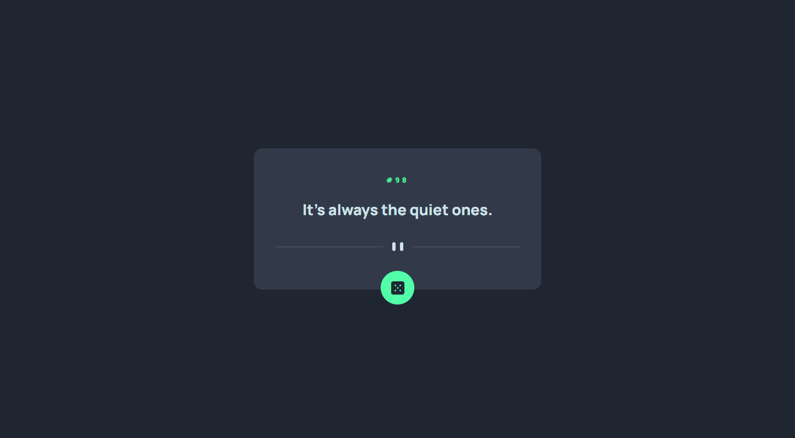

# Frontend Mentor - Advice generator app solution

This is a solution to the [Advice generator app challenge on Frontend Mentor]

## Table of contents

- [Overview](#overview)
  - [The challenge](#the-challenge)
  - [Screenshot](#screenshot)
  - [Links](#links)
- [My process](#my-process)
  - [Built with](#built-with)
  - [What I learned](#what-i-learned)
  - [Continued development](#continued-development)
  - [Useful resources](#useful-resources)
- [Author](#author)
- [Acknowledgments](#acknowledgments)

## Overview

basic API practice with a little bit of color flipper sauce

### The challenge

Users should be able to:

- View the optimal layout for the app depending on their device's screen size
- See hover states for all interactive elements on the page
- Generate a new piece of advice by clicking the dice icon

### Screenshot



### Links

- Solution URL: [Add solution URL here](https://your-solution-url.com)
- Live Site URL: [Add live site URL here](https://your-live-site-url.com)

## My process

the process is basic API practice using async await i recive a data from API host url and convert it to json()/Javascript object notation/ after that i use a couple of object destructuring to extract a desired datas and insert it to the HTML...

```js
const fetchData = async () => {
  const data = await fetch(url);
  const adviceObject = await data.json();
  const slip = adviceObject.slip;

  return slip;
};
```

and also i envoke the initializer function(init) once the DOMContentLoaded and also when the btn is clicked.

```js
//initializer func
const init = async () => {
  const advice = await fetchData();
  displayAdvice(advice);
};

//invoking function when dom content loaded and also when btn clicked
window.addEventListener('DOMContentLoaded', init);
toogleBtn.addEventListener('click', init);
```

### Built with

- Semantic HTML5 markup
- CSS custom properties
- Flexbox
- CSS Grid
- Mobile-first workflow
- SCSS
- Module js file separation
- API

### What I learned

animating the advice card each and every time a btn clicked

### Continued development

object and array destructuring

## Author

- Frontend Mentor - [@yishak621](https://www.frontendmentor.io/profile/yourusername)
- Linkdin - [@yishak](https://www.linkedin.com/in/yishak-abrham-2a865611b)

## Acknowledgments

thanks to frontend mentor
